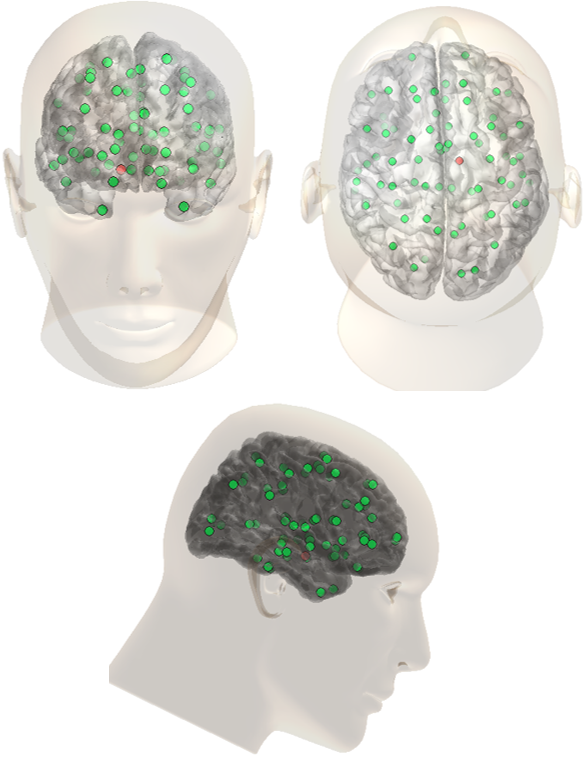

# TVB-DBS-Thalamus-Model

This repository contains scripts and data to simulate and analyze Deep Brain Stimulation (DBS) effects using The Virtual Brain (TVB) platform with a custom thalamic model.

---

## 🧪 EEG Analysis (FieldTrip)

`analyze_simulated_eeg.m` provides an end-to-end analysis pipeline of simulated EEG from DBS models using [FieldTrip](https://www.fieldtriptoolbox.org/). It includes:

- Artifact rejection  
- Epoching around stimulation events  
- ERP and GMFP computation  
- Topographical plotting

---

## 🧠 TVB Head Model Visualization

`plot_tvb_headmodel.m` provides a 3D visualization of a head model based on structural data from *The Virtual Brain* (TVB). It includes:

- Loading of cortical and scalp surface meshes  
- 3D rendering of the head model  
- Plotting of cortical region centers (nodes), with selected nodes (e.g., amygdala) highlighted  
- Optional saving of the resulting figure  

### 📁 Required files

- `cortex/vertices.txt`, `cortex/triangles.txt`  
- `face/vertices.txt`, `face/triangles.txt`  
- `centers.txt` containing XYZ coordinates of brain region centers  

### 📦 Data origin

All `.txt` files were generated using the TVB software with a connectivity matrix of **76 brain regions**.

### 📸 Output

- A 3D figure of the head model with both surfaces and region centers

### 💡 Note

Highlighted nodes can be customized in the script by modifying the `highlight_nodes` array.

### 🖼 Example Output



---

## 📂 Project Structure

```
tvb-dbs-thalamus-model/
├── cortex/
├── face/
├── scripts/
├── tvb_model_thalamus/
├── figures/
├── README.md
└── ...
```

---

## 🔧 Requirements

- MATLAB with 3D plotting enabled
- FieldTrip (for EEG analysis)
- TVB (to generate structural data)

---

## 📬 Contact

For questions or collaborations, feel free to open an issue or contact [Lorenzo Prione](https://github.com/Prions).
